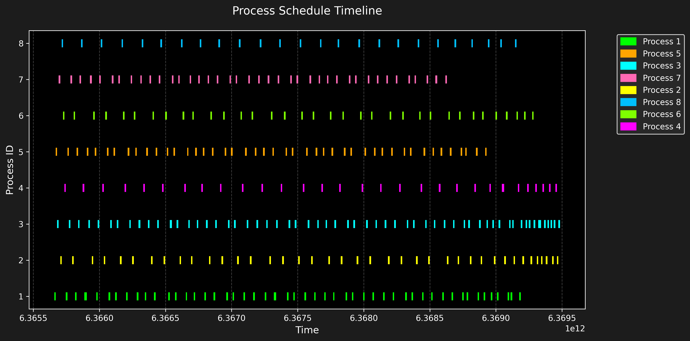

# Linux Task Scheduler Simulation

A C++ simulation of the **Completely Fair Scheduler (CFS)** used in the Linux kernel. The project demonstrates how CPU-bound and I/O-bound tasks are scheduled using concepts such as `vruntime`, task weight, priority, and a runqueue.

---

## Overview

The **Completely Fair Scheduler (CFS)** is designed to provide fair CPU time to processes by using a virtual runtime (`vruntime`) value.

The scheduler generally selects the task with the smallest `vruntime` from the runqueue. Task priority is represented using a weight value, which affects how quickly the task's `vruntime` increases.

This simulation focuses on:

* CPU-bound tasks
* I/O-bound tasks
* Task priority
* Task weight
* Virtual runtime (`vruntime`)
* Runqueue-based scheduling
* Scheduling visualization

---

## Key Concepts

### Weight

Each task has a weight based on its priority.

```text
weight = NICE_0_LOAD / (priority + 1)
```

In this simulation:

```text
NICE_0_LOAD = 1024
```

A task with a higher weight receives relatively more CPU time.

### Virtual Runtime

`vruntime` represents the virtual amount of CPU time consumed by a task.

The simulation uses:

```text
vruntime += (executed_time * NICE_0_LOAD) / weight
```

Tasks with smaller `vruntime` values are selected earlier by the scheduler.

### Runqueue

The runqueue maintains the tasks waiting for CPU execution.

The task with the smallest `vruntime` is selected for execution.

---

## Scheduling Logic

### CPU-Bound Tasks

CPU-bound tasks primarily use CPU resources.

For each CPU-bound task:

1. The task is selected from the runqueue.
2. It executes for a fixed time slice of approximately 1ms.
3. Its `vruntime` is updated.
4. Its remaining CPU burst time is reduced.
5. If work remains, the task is added back to the runqueue.

### I/O-Bound Tasks

I/O-bound tasks frequently wait for I/O operations.

For each I/O-bound task:

1. The task simulates an I/O wait.
2. The simulation uses a fixed I/O wait duration of approximately 10ms.
3. The task's scheduling state and `vruntime` are updated.
4. The task receives a short CPU time slice.
5. If work remains, the task is added back to the runqueue.

---

## How It Works

The simulation follows these main steps:

### 1. Initialization

Tasks are initialized with parameters such as:

* Process ID
* CPU burst time
* Priority
* Weight
* Initial `vruntime`
* Task type

Tasks are then added to the runqueue.

### 2. Task Selection

The scheduler selects the task with the smallest `vruntime`.

### 3. Task Execution

The selected task receives CPU time according to its task type.

CPU-bound tasks directly use the CPU, while I/O-bound tasks simulate I/O waiting before receiving CPU time.

### 4. vruntime Update

After execution, the task's `vruntime` is updated according to its execution time and weight.

### 5. Requeue

If the task still has remaining CPU work, it is placed back into the runqueue.

### 6. Termination

The simulation continues until all tasks complete their required CPU burst time.

---

## Project Structure

```text
Linux-Task-Scheduler-Simulation/
│
├── .vscode/                    # VS Code configuration
├── nlohmann/                   # JSON library
├── resources/                  # Project resources
├── src/                        # Scheduler source files
│
├── .gitignore
├── CMakeLists.txt              # CMake build configuration
├── main.cpp                    # Main program
├── plot.py                     # Scheduling visualization script
├── process_schedule.csv        # Generated scheduling data
├── process_schedule_dark.png   # Scheduling visualization
├── tasks.json                  # Task configuration
└── README.md
```

---

## Requirements

Before building the project, make sure the following are installed:

* C++ compiler
* CMake
* Make
* Python 3
* Python plotting dependencies

For Linux/WSL, you can verify the installations using:

```bash
g++ --version
cmake --version
python3 --version
```

---

## Getting Started

### 1. Clone the Repository

```bash
git clone https://github.com/supabhinav/Linux-Task-Scheduler-Simulation.git
```

Move into the project directory:

```bash
cd Linux-Task-Scheduler-Simulation
```

### 2. Create the Build Directory

```bash
mkdir build
cd build
```

### 3. Configure the Project

```bash
cmake ..
```

### 4. Build the Project

```bash
make
```

### 5. Run the Scheduler Simulation

```bash
./cfs-schedular
```

If the executable name differs after building, check the generated files inside the `build` directory.

### 6. Generate the Visualization

Return to the project root:

```bash
cd ..
```

Run:

```bash
python3 plot.py
```

The script uses the generated scheduling information to visualize the execution of the processes.

---

## Simulation Scenarios

The project demonstrates scheduling behavior using two types of processes.

### I/O-Bound Processes

The first scenario contains I/O-bound processes with different priorities and `vruntime` values.

I/O-bound processes simulate waiting periods before receiving CPU time. Their scheduling behavior is affected by their priority, weight, and `vruntime`.

### CPU-Bound Processes

The second scenario contains CPU-bound processes.

Processes with different priorities and initial `vruntime` values compete for CPU time. The scheduler repeatedly selects the process with the smallest `vruntime`.

---

## Visualization

The project generates scheduling information in:

```text
process_schedule.csv
```

The scheduling results can then be visualized using:

```text
plot.py
```

An example visualization is included in:

```text
process_schedule_dark.png
```



---

## Technologies Used

* **C++**
* **CMake**
* **Python**
* **JSON**
* **Linux Scheduling Concepts**
* **Completely Fair Scheduler (CFS)**
* **Process Scheduling**
* **Data Visualization**

---

## Learning Objectives

This project helps demonstrate:

* How CPU scheduling works
* The basic principles behind Linux CFS
* Virtual runtime-based scheduling
* Task priority and weight
* CPU-bound vs I/O-bound workloads
* Runqueue-based task selection
* Simulation and visualization of scheduling behavior

---

## Repository

GitHub:

https://github.com/supabhinav/Linux-Task-Scheduler-Simulation
